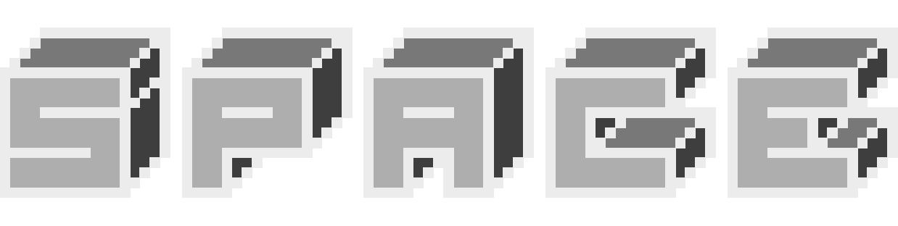

# SPACE - The game
### Idea
The emotion I wanted to evoke out of this game was frustration. The classic hard to defeat game that goes on forever (main inspiration = Flappy Bird). I also wanted to make the game as simple as possible. I decided early on that the game should only have one control. It was important to me, with this game dynamic, for the game to evolve around the player as much as possible. Finally, I came up with the idea of "space": An endless greyscale platformer that can change it's main game mechanic randomly throughout the game but keeping the ability to interact limited and constant. I went with the space bar.

### Sprite design
I went through multiple iterations for the main sprite which was to fit in with the theme of the game. That is: simple, greyscale, space. I opted for some pixel art that resembled an old school keyboard key with an old school space icon. Below you can see my iterative process:
\

\
For the background, with the same theme in mind, I went for a pixelated star field - or pixelated space (pun intended).

### Things to add
There is much to add to this prototype. Firstly the mechanics of the game need tweaking so that there are better signifiers for when the state has changed (although I would like to keep this subtle). I also plan to add at least 2 more states. One could be a flappy bird-keyhole arcade game combo where holding space increases lift to fit through a gap. Another could be pressing space at specific collisions (like guitar hero). I also need to change the score system such that it increments not with a clock but with a player's successful pass over each obstacle - this would serve to give the player more satisfaction within the experience of playing my game.
\
\
\
To view footage of the game in its current state click [here](https://www.youtube.com/watch?v=uM4tRXw0E60)
\
To play the game in its current state yourself click [here](https://smithwrinch.itch.io/space)